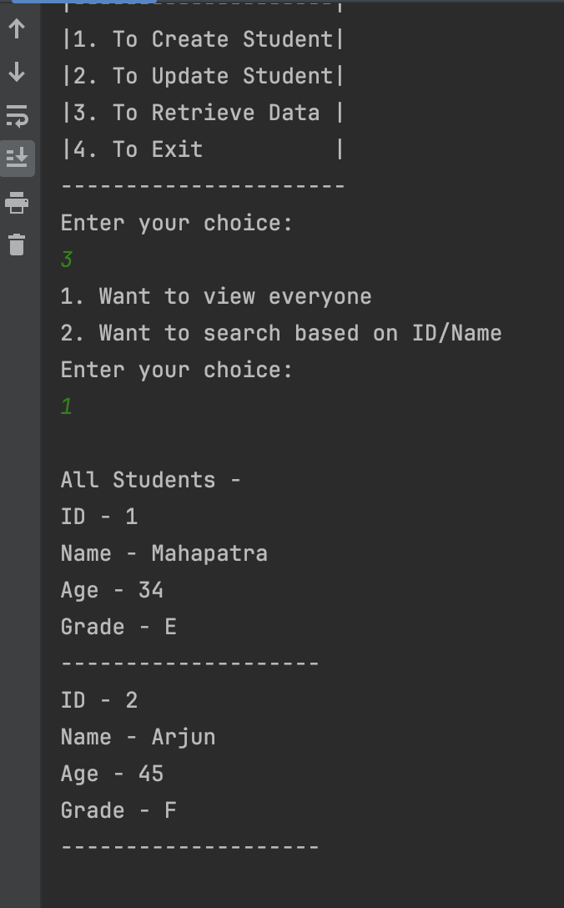

# Homework 1

Demo Video

https://video.drift.com/v/ab4ug4NcThM7TYvHG0TMW4AjoNLaT4WPZP7KwSwstdUM/

## Output Screenshots -

<u>Create</u>

<u>Update</u>

<u>Retreive</u>

<u>Search</u>

## About

Student Portal built using Maven submodule architecture.

Submodules:

1. core
2. data
3. logging
4. app

External Dependencies:

- Logback/S4LJ (for logging)

Built With:

- ![Maven][Maven]
- ![Java][Java]
- ![Intellij][Intellij]

[Maven]: https://img.shields.io/badge/maven-C71A36?style=for-the-badge&logo=apachemaven&logoColor=white
[Java]: https://img.shields.io/badge/Java-ED8B00?style=for-the-badge&logo=openjdk&logoColor=white
[Intellij]: https://img.shields.io/badge/Intellij_IDEA-000000?style=for-the-badge&logo=intellijidea&logoColor=white
